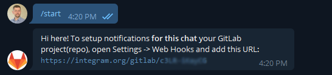

# Оповещения из gitlab в telegram

Для получения оповещений можно пользоваться ботом [Gitlab](https://telegram.me/gitlab_bot). 

Далее, на странице настроек _https://gitlab.onix.ua/onix-systems/%PROJECT_NAME%/-/settings/integrations_, введите в поле полученый из бота URL и выберите события на которые вы хотите подписаться.